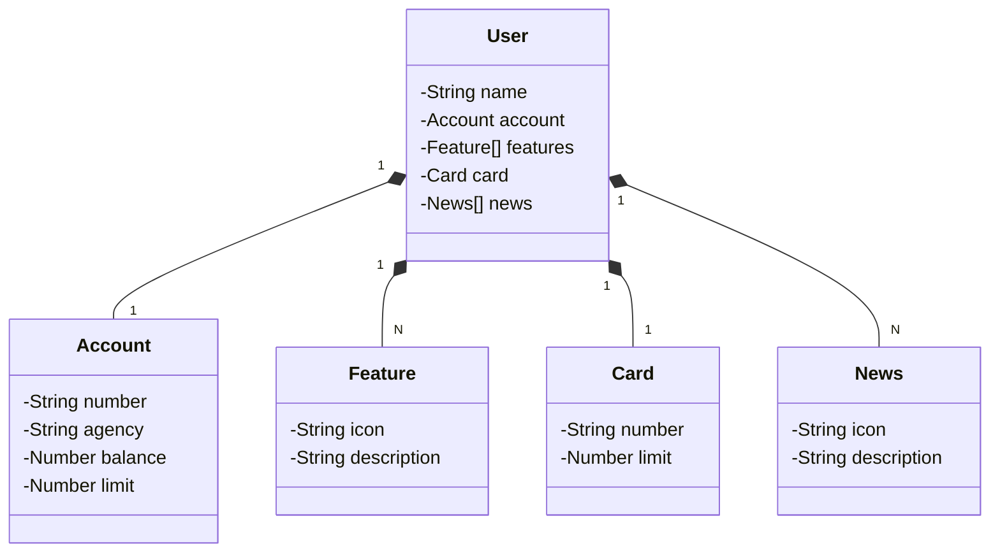

# Projeto final do Bootcamp Java, da empresa DIO + Santander
Como projeto final do bootcamp Java oferecido pela empresa [DIO](https://www.linkedin.com/school/dio-makethechange/posts/?feedView=all) em parceria com o [Santander](https://www.linkedin.com/company/santander-open-academy/), este é um desenvolvimento de uma API RESTful simulando uma conta bancária.

## Principais Tecnologias
 - **Java 17**
 - **Spring Boot 3**
 - **Spring Data JPA**
 - **OpenAPI (Swagger)**
 - **Railway**

## Diagrama de Classes (Domínio da API)

O Diagrama de Classes desta aplicação foi desenvolvida em sintaxe Mermaid, através de um Modelo de Inteligência Artificial Generativa.

