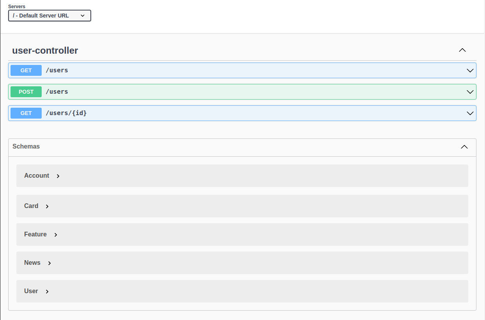
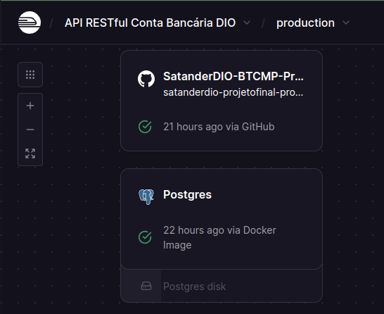

# Projeto final do Bootcamp Java, da empresa DIO + Santander
Como projeto final do bootcamp Java oferecido pela empresa [DIO](https://www.linkedin.com/school/dio-makethechange/posts/?feedView=all) em parceria com o [Santander](https://www.linkedin.com/company/santander-open-academy/), este é um desenvolvimento de uma API RESTful simulando uma conta bancária.

## Principais Tecnologias
 - **Java 17**
 - **Spring Boot 3**
 - **Spring Data JPA**
 - **OpenAPI (Swagger)**
 - **Railway**


## Diagrama de Classes (Domínio da API)

O Diagrama de Classes desta aplicação foi desenvolvida em sintaxe Mermaid, através de um Modelo de Inteligência Artificial Generativa.


## Endpoints
### POST
`/users/`: Por meio de um JSON, cria um usuário. Validação é feita pelo Id e pelo Account number, onde há um tratamento de possíveis erros, como a tentativa de criar um usuário já registrado.
 
### GET
`/users/{id}`: Retorna uma URL e um JSON com as informações do usuário buscado. Eventualmente, existe tratamento de erro para caso o usuário filtrado não exista.

<div align="center">
 
</div>

## Publicação
Um dos objetivos deste projeto, é realizar o deploy da aplicação, e torná-la disponível para ser consumida.
  Portanto, utilizamos a plataforma [Railway](https://railway.app/) para:
  1. Criar um Banco de Dados PostgreSQL em nuvem;
  2. Realizar o deploy;
  3. Publicar através de um domínio personalizado.
      
<div align="center">
    
</div>

  
  O link da aplicação não estará disponível, uma vez que o serviço é pago e fora utilizado o plano Trial para configurar e publicar, entretanto, segue o endereço:  
https://satanderdio-projetofinal-production.up.railway.app/swagger-ui/index.html#/

## Pré-requisitos

Para executar os códigos deste repositório, você precisará ter instalado:

- [Java JDK 8+](https://www.oracle.com/java/technologies/javase-jdk11-downloads.html)
- Um IDE de sua escolha (por exemplo: o [IntelliJ IDEA](https://www.jetbrains.com/idea/) ou o [Eclipse](https://www.eclipse.org/))
- Conta no [Railway](https://railway.app/)

## Instalação

1. Clone o repositório para a sua máquina local:
    ```sh
    git clone https://github.com/seu-usuario/SatanderDIO-BTCMP-ProjetoFinal.git
    ```
2. Navegue até o diretório do repositório:
    ```sh
    cd SatanderDIO-BTCMP-ProjetoFinal
    ```
    
## Contribuição

Contribuições são bem-vindas! Se você quiser contribuir com este projeto, por favor siga estas etapas:

1. Faça um fork deste repositório.
2. Crie uma branch com a sua feature: `git checkout -b minha-feature`
3. Commit suas mudanças: `git commit -m 'Adicionar minha feature'`
4. Faça o push para a branch: `git push origin minha-feature`
5. Abra um Pull Request.

## Contato
Gostou do projeto?  
Tem uma sugestão, crítica ou elogio?  
Você pode me encontrar no Linkedin:  
  
  [](https://www.linkedin.com/in/galasso-matheus/)

